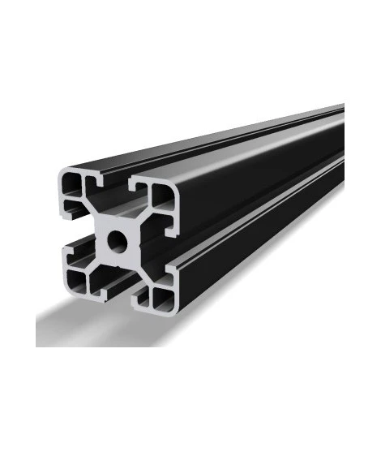
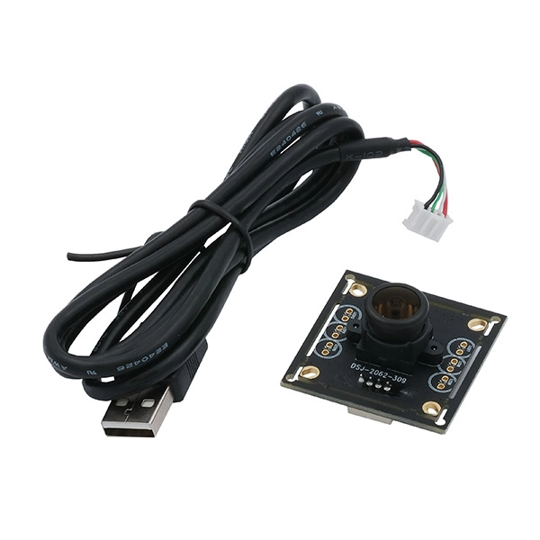

# Conception et prototypage

Afin d'obtenir un robot optimisé et des plus performant, nous avons décidés de nous répartir les tâches. Chacun a choisis les missions où il pensait être le plus productif. Bien que nous étions chacuns sur notre partie par 2 ou par 3, nous sommes un groupe. C'est pourquoi en cas d'imprévus ou d'incompréhension, nous pouvons toujours compter les uns sur les autres.

## -Pièces mécaniques

**-Pompe :** 

Nous n'avons pas reçu la pompe dès les premiers jours. Afin de combler ce temps, nous nous sommes renseignés directement sur les différentes façons de la faire fonctionner. Ainsi, dès l'obtention de cette dernière, nous avons pu la connecter à notre carte arduino et commencer différents tests. 
Nous avons eu un pépin car lorsque la pompe aspirait, tout allait bien. En revanche, elle ne lachait pas la pièce correctement. La pièce se décrochait juste avec le temps (et la gravité) et le manque d'aspiration, non pas car nous avions décider de lacher la pièce. Suite à de nombreuses minutes de recherches, nous avons réalisé que la puissance envoyée par la carte n'était pas suffisante et qu'il fallait un nouveau driver. Pour cela, nous avons utiliser Kicad.

<iframe height="400" width="80%" src="https://modelembedder.net/embed?did=dc4e4dc410142a1f5ec17e75&wvm=v&wvmid=8dbde0cae67cbb0ab40cced3&eid=3f834839403a2d3bfa00f478&elementType=PARTSTUDIO" frameborder="0"></iframe>

**-Electro-vanne :** 

Pour manipuler les pièces du puzzle de manière automatisée, le robot utilise un système de préhension par le vide associant la pompe à air vue précédemment et une électrovanne. La pompe fonctionne en continu pour générer une aspiration au niveau du circuit pneumatique alors que l'électrovanne fait office de gâchette contrôlée électroniquement par la carte de commande (CNC).

<iframe height="400" width="80%" src="https://modelembedder.net/embed?did=dc4e4dc410142a1f5ec17e75&wvm=v&wvmid=8dbde0cae67cbb0ab40cced3&eid=0a388f719ae6b50022233bb5&elementType=PARTSTUDIO" frameborder="0"></iframe>

**-Moteur pas-à-pas :** 

Le moteur pas-à-pas est utilisé pour se déplacer plus précisement. Il fonctionne en convertissant les impulsions électriques en mouvements angulaires discrets. Chaque impulsion appliquée au moteur le fait tourner d’un certain angle, appelé “pas”. En contrôlant la séquence d’impulsions, il est possible de faire tourner le moteur dans les deux sens, de manière plus ou moins rapide.

<iframe height="400" width="80%" src="https://modelembedder.net/embed?did=dc4e4dc410142a1f5ec17e75&wvm=v&wvmid=8dbde0cae67cbb0ab40cced3&eid=5e57f97f026c1f00d2344900&elementType=PARTSTUDIO" frameborder="0"></iframe>

**-Les ServoMoteurs :**

Utilisé pour piloter un mouvement angulaire limité et pour contrôler les mouvements précis de certaines pièces, comme la direction, les ailerons ou encore les gouvernes. C’est un composant essentiel dans les systèmes qui nécessitent des déplacements angulaires contrôlés. Le servomoteur RC combine un moteur électrique, un réducteur, un potentiomètre et un contrôleur électronique dans un seul boîtier compact.

<iframe height="400" width="80%" src="https://modelembedder.net/embed?did=dc4e4dc410142a1f5ec17e75&wvm=v&wvmid=8dbde0cae67cbb0ab40cced3&eid=f79d90442e1b479fbb8716f7&elementType=PARTSTUDIO" frameborder="0"></iframe>

**-La CNC Shield :**

Le CNC Shield est une carte d’extension pour Arduino, qui permet de contrôler facilement des machines à commande numérique (CNC), comme des fraiseuses, des machines de gravure, des imprimantes 3D et des traceurs de dessin.

<iframe height="400" width="80%" src="https://modelembedder.net/embed?did=dc4e4dc410142a1f5ec17e75&wvm=v&wvmid=8dbde0cae67cbb0ab40cced3&eid=7ac83cab871f620abcc97dbd&elementType=ASSEMBLY" frameborder="0"></iframe>

## -Autres matériaux

**-Le plateau :**

Le plateau nous a été donné dès le début. Nous avons directement enlevé les pieds qu'il avait afin d'en créer de nouveaux bien plus hauts. Cela nous a permis d'avoir accès au dessous du plateau afin de centraliser les câbles en dessous notamment mais également pour faire bouger un axe de manière stable sur les profilés déjà intégrés au plateau.

<iframe height="400" width="80%" src="https://modelembedder.net/embed?
did=dc4e4dc410142a1f5ec17e75&wvm=v&wvmid=8dbde0cae67cbb0ab40cced3&eid=5b8cf4061a48a1c36296fab5&elementType=ASSEMBLY" frameborder="0"></iframe>

**-Les profilé :**

Nous avons eu accès à des morceaux de profilé en aluminium en croix. Ils sont la base de notre machine que ce soit pour la robustesse qu'ils apportent, la légèreté ou encore la stabilité lors des mouvements au creux de ces profilés.

**-La Camera :**
On nous a transmis une Camera fit0892 ,qui est une Caméra USB avec un large angle de vision et une excellente qualité de capture.

**-Les ressources liées au maker space :**

Nous avons affectivement au accès à bon nombre de ressources au maker space. Tout d'abord, les imprimantes 3D grâce auxquelles nous avons pu réaliser toutes nos pièces en commençant avec les coins jusqu'aux caches câbles. Nous avons pu utiliser toutes les machines nous permettant d'usiner les pièces qui le nécessitaient également ainsi que les câbles nous permettant de rallonger les connexions afin de rendre le projet plus propre en envoyant tous les câbles sous le plateau.

