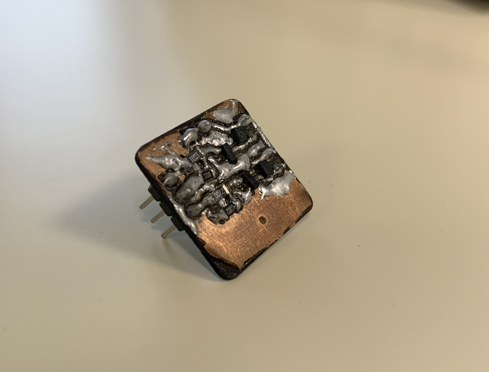
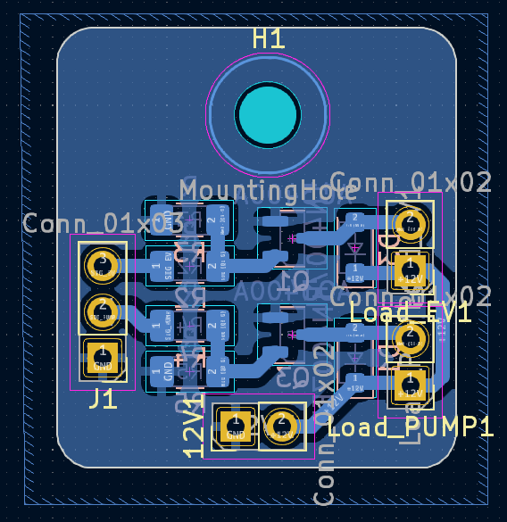
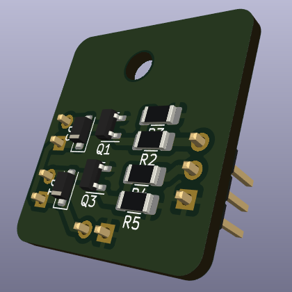
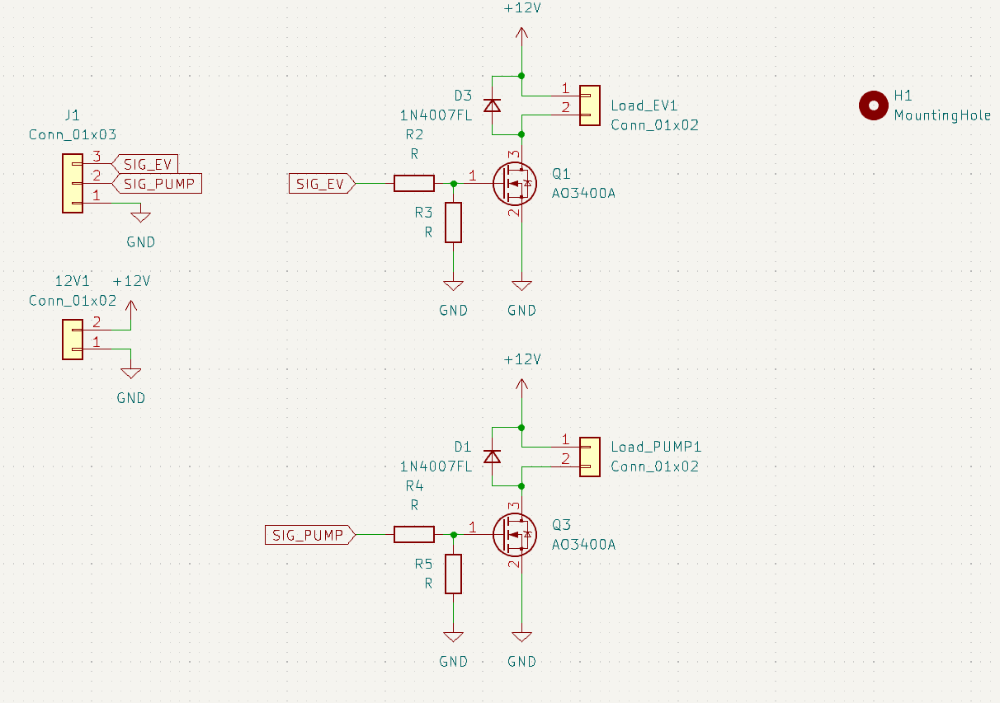

# Matériaux et prototypage

Afin d'obtenir un robot optimisé et des plus performant, nous avons décidés de nous répartir les tâches comme expliqué précédemment. Chacun a choisis les missions où il pensait être le plus productif. Bien que nous étions chacuns sur notre partie par 2 ou par 3, nous sommes un groupe. C'est pourquoi en cas d'imprévus ou d'incompréhension, nous pouvons toujours compter les uns sur les autres.

Voici une liste de tout le matériel que nous avons eu ainsi que comment nous avons réfléchis au prototypage.

## Matériaux

### -Pièces mécaniques

**-Pompe :** 

Nous n'avons pas reçu la pompe dès les premiers jours. Afin de combler ce temps, nous nous sommes renseignés directement sur les différentes façons de la faire fonctionner. Ainsi, dès l'obtention de cette dernière, nous avons pu la connecter à notre carte arduino et commencer différents tests. 

Nous avons eu un pépin car lorsque la pompe aspirait, tout allait bien. En revanche, elle ne lachait pas la pièce correctement. La pièce se décrochait juste avec le temps (et la gravité) et le manque d'aspiration, non pas car nous avions décider de lacher la pièce. Suite à de nombreuses minutes de recherches, nous avons réalisé que la puissance envoyée par la carte n'était pas suffisante et qu'il fallait un nouveau driver. Pour cela, nous avons utiliser Kicad.

<model-viewer src="../3D/Pompe.gltf" style="width: 100%; height: 550px;" ar ar-modes="webxr scene-viewer quick-look" camera-controls tone-mapping="neutral" poster="poster.webp" shadow-intensity="1">
    

        

    

</model-viewer>

**-Electro-vanne :** 

Pour manipuler les pièces du puzzle de manière automatisée, le robot utilise un système de préhension par le vide associant la pompe à air vue précédemment et une électrovanne. La pompe fonctionne en continu pour générer une aspiration au niveau du circuit pneumatique alors que l'électrovanne fait office de gâchette contrôlée électroniquement par la carte de commande (CNC).

<model-viewer src="../3D/Electrovanne.gltf" style="width: 100%; height: 550px;" ar ar-modes="webxr scene-viewer quick-look" camera-controls tone-mapping="neutral" poster="poster.webp" shadow-intensity="1">
    

        

    

</model-viewer>

**-Moteur pas-à-pas :** 

Le moteur pas-à-pas est utilisé pour se déplacer plus précisement. Il fonctionne en convertissant les impulsions électriques en mouvements angulaires discrets. Chaque impulsion appliquée au moteur le fait tourner d’un certain angle, appelé “pas”. En contrôlant la séquence d’impulsions, il est possible de faire tourner le moteur dans les deux sens, de manière plus ou moins rapide. 

Nous nous sommes vite rendu compte que les moteurs n'étaient pas assez précis et avaient des problèmes de vitesse. Nous avons donc mis en place des cavaliers pour optimiser les déplacements liés aux moteurs. Ces cavaliers permettent d'activer le microstepping, une technique consistant à diviser électroniquement chaque pas mécanique du moteur. Cette configuration est indispensable pour accroître la précision de positionnement du bras lors de la manipulation des pièces, tout en réduisant considérablement les vibrations, les saccades et le bruit de fonctionnement des moteurs. Cela a très bien fonctionné sur nos moteurs et nous a permis de décupler notre précision.

<model-viewer src="../3D/Moteurpasapas.gltf" style="width: 100%; height: 550px;" ar ar-modes="webxr scene-viewer quick-look" camera-controls tone-mapping="neutral" poster="poster.webp" shadow-intensity="1">
    

        

    

</model-viewer>

**-Les ServoMoteurs :**

Utilisé pour piloter un mouvement angulaire limité et pour contrôler les mouvements précis de certaines pièces, comme la direction, les ailerons ou encore les gouvernes. C’est un composant essentiel dans les systèmes qui nécessitent des déplacements angulaires contrôlés. Nous en utilisons deux dans notre machine. Un pour faire la rotation de la pièce au niveau de la pompe et un second qui va nous permettre de lever la pompe afin de la coller à la pièce puis de la lever.

La limite de rotation d'un servo-moteur a constitué un challenge concernant la manière de changer l'orientation des pièces.

<model-viewer src="../3D/Servomoteur.gltf" style="width: 100%; height: 550px;" ar ar-modes="webxr scene-viewer quick-look" camera-controls tone-mapping="neutral" poster="poster.webp" shadow-intensity="1">
    

        

    

</model-viewer>

**-La CNC Shield :**

Le CNC Shield est une carte d’extension pour Arduino, qui permet de contrôler facilement des machines à commande numérique. Les drivers des moteurs vont y être raccordés afin de les synchroniser.

Nous l'avons disposée sous la machine afin que tous les câbles qui lui sont reliés ne se baladent pas librement au dessus de la machine. Cela risquerait d'interférer avec le bon fonctionnement du puzzle-bot.

<model-viewer src="../3D/CNCshield.gltf" style="width: 100%; height: 550px;" ar ar-modes="webxr scene-viewer quick-look" camera-controls tone-mapping="neutral" poster="poster.webp" shadow-intensity="1">
    

        

    

</model-viewer>

**-La Camera :**

On nous a transmis une Camera fit0892 qui est une Caméra USB avec un large angle de vision et une excellente qualité de capture. Nous l'avons fixée sur le robot à l'aide d'une pièce que nous avons imprimée en 3D. Nous l'avons ensuite placée dans une position optimale afin de capturer l'entièreté du plateau. Cela nous évite d'avoir à la bouger pour qu'elle puisse capturer l'ensemble de la surface de travail à chaque mouvement. 

Elle n'est pas arrivée dès le début du projet donc cela a constitué un challenge enrichissant puisque nous ne savions ni comment communiquer avec, ni sa résolution, ses dimensions, etc.

**-Le Bouton d'arret d'urgence:**

Notre robot est équipé d’un bouton d’arrêt d’urgence permettant d’arrêter immédiatement la machine en cas de problème ou de danger. Placé à un endroit facilement accessible (sur le côté de la machine) et aisément identifiable grâce à sa couleur rouge, il assure la sécurité des utilisateurs en coupant instantanément le fonctionnement du système. Son intégration constitue un élément essentiel pour garantir une utilisation sûre du robot lors des phases de test et d’exploitation avec cette possibilité de tout arrêter quand on le souhaite.

Nous avons pu lui fabriquer une pièce en 3D afin de l'acceuillir et de la scéler avec le côté du plateau.

<model-viewer src="../3D/Emergency Stop Button.gltf" style="width: 100%; height: 550px;" ar ar-modes="webxr scene-viewer quick-look" camera-controls tone-mapping="neutral" poster="poster.webp" shadow-intensity="1">
    

        

    

</model-viewer>

**-Le MOSFET:**

Nous avons réalisé une carte électronique sous 12 volts car l'électrovanne ne fonctionnait que sous cette tension. Nous avons conçu ce circuit imprimé sur KiCad. Nous avons dû fabriquer la carte à trois reprises car elle ne supportait pas correctement la tension de 12 V requise pour l’électrovanne. Ces problèmes étaient principalement dus à des erreurs de soudage ainsi qu’à des choix de composants inadaptés lors des premières versions du circuit.

### -Autres matériaux

**-Le plateau :**

Le plateau nous a été donné dès le début. Nous avons directement enlevé les pieds qu'il avait afin d'en créer de nouveaux bien plus hauts. Cela nous a permis d'avoir accès au dessous du plateau afin de centraliser les câbles en dessous notamment mais également pour faire bouger un axe de manière stable sur les profilés déjà intégrés au plateau.

La taille assez restreinte du plateau était un challenge puisqu'il n'est pas évident de faire une machine sur un plateau de cette dimension qui puisse rester fixée dessus.

<model-viewer src="../3D/PuzzleBot.gltf" style="width: 100%; height: 550px;" ar ar-modes="webxr scene-viewer quick-look" camera-controls tone-mapping="neutral" poster="poster.webp" shadow-intensity="1">
    

        

    

</model-viewer>

**-Les profilés :**

Nous avons eu accès à des morceaux de profilés en aluminium en croix. Ils sont la base de notre machine que ce soit pour la robustesse qu'ils apportent, la légèreté ou encore la stabilité lors des mouvements au creux de ces profilés.

Bien que nous ayons eu la possibilité de les découper à note guise, nous avons préféré les garder intact puisque cela ne change pas l'efficacité de la machine et cela permettra de les réutiliser par la suite.

**Prototypage mécanique et Impression 3D**

### Méthodologie de prototypage

Le développement du Puzzle Bot a suivi une démarche de prototypage rapide et itérative. Nous avons expérimenté et appris de nos essais. L'objectif était de valider chaque sous-système (mécanique, électronique et logiciel) de manière indépendante avant l'assemblage final sur le plateau.

Nous avons en permanence prêté attention aux consignes de sécurité afin de ne pas se retrouver victime d'un accident évitable.

L'accès aux imprimantes 3D du Makerspace a été crucial pour concevoir nos pièces sur mesure (supports moteurs, fixation de la caméra, boîtier de l'arrêt d'urgence, des profilés sur les côtés etc).

Plutôt que d'imprimer directement des pièces massives et définitives, nous avons procédé par étapes.

Tout d'abord, les prototypes à faible résolution servant à vérifier uniquement les axes des vis, les tolérances géométriques et l'ajustement sur les profilés alu.

Puis les ajustements au fur et à mesure des essais. Par exemple, le support de la caméra a été modifié à deux reprises pour corriger l'angle d'inclinaison afin que l'objectif englobe parfaitement la totalité de la zone de jeu sans angle mort.

**Prototypage électronique**

L'intégration de la pompe et de l'électrovanne 12V a nécessité une transition prudente pour ne pas risquer d'endommager la carte Arduino. Nous avons créé la carte sur KiCad (vue ci-dessous) puis nous l'avons faite vérifier par les enseignants. Nous l'avons ensuite imprimée puis soudée dans un sens avant de nous rendre compte que le schéma était dans le mauvais sens. Le prototypage nous a permis d'éviter de causer de gros dommages et de corriger notre erreur.

            

Une fois le schéma validé, nous sommes passés à la gravure puis à la soudure de notre carte MOSFET. Les échecs successifs sur les premières versions (problèmes de soudure et surchauffe) nous ont appris à dimensionner correctement les pistes pour supporter la tension de 12V requise par l'électrovanne.

**Tests d'aspiration**

Le prototypage du système de vide a été l'un de nos plus grands défis mécaniques. Lors des premiers essais, la ventouse entrait bien en dépression pour soulever la pièce de puzzle, mais nous ne pouvions pas bloquer la pompe autrement qu'en la faisant aspirer en continu ce qui empêchait le robot de la relâcher instantanément au moment de couper la pompe. 

C'est l'intégration de la carte couplée à l'éléctrovanne dans le circuit qui a résolu le problème en agissant comme une rupture de charge, évacuant l'air instantanément pour garantir un dépôt précis et propre de la pièce sur le plateau.

**Intégration et routage final**

La dernière phase a consisté à implanter tous ces prototypes sous le plateau. Ce choix d'architecture (centraliser la CNC Shield, la carte MOSFET et l'alimentation sous la structure) a permis de libérer l'espace supérieur pour les mouvements des axes mécaniques et de protéger les connexions des perturbations liées aux déplacements du robot.
