Conception
boitier
 on a concu de sorte a ce quelle dissipe la chaleur

Nous devions avec tout ces composants 

deux moteurs axe x donc 2 couroies syncro grace au drivers 
un moteur axe y donc 1 couroie 

model cartesien  Calcul des distances : utile pour les algorithmes de recherche de chemin ou pour estimer à quelle distance une pièce est de sa position cible.
					Visualisation intuitive : le modèle correspond directement à ce qu'on voit à l'écran sur une grille.
					Simple à comprendre : chaque case a une position unique (ex. (3, 5)).
					facilite pour le code
					precision axe x car 2 moteurs 
tension des couroie symetrique 
pour que le projet sois refaisable part tout le monde. on a decide de faire des pieces symetrique comme les support moteur axe x au quatre coins dde la machine (photo one shape 4 coin)
pareil pour les le support moteur axe y (photo one shape)
support camera (photo one shape)
glissiere tension  couroie (photo one shape)
)

option 
integration 
glissiere pour cable management(photo one shape)
chain cable (photo one shape)
plaque sous la plaque de base pour cacher les cables (photo one shape)
camera piéce symetrique pour avoir le moins de pieces a imprimer (photo one shape) on a decide de fixer la camera a deux apieds pour ameliorer la stabilité et donc ameliorer la precision de la camera pour eviter quelle bouge
			

# Conception du Puzzle bot
Comme dit
La conception 3D a été réalisée principalement sur Onshape. Nous avons utilisé des modèles existants pour certains composants clés, notamment le plateau, les servomoteurs, ainsi que le profilé en aluminium. Le plateau a été modélisé avec les dimensions précises pour accueillir les courroies et les moteurs. Les servomoteurs ont été placés en respectant les contraintes de couple et d'espace, et la barre métallique a été dimensionnée pour assurer la rigidité et la stabilité de l'ensemble. Ensuite, nous avons intégré tous ces éléments dans un assemblage complet pour vérifier les ajustements, les tolérances et la compatibilité entre les pièces. Cette base nous a permis de garantir un bon alignement mécanique avant de passer aux impressions et à l’assemblage final.

Nous avons également conçu des pièces de finition spécifiques pour améliorer la sécurité et l'organisation des câbles. Par exemple, nous avons créé des étriers qui viennent toucher les capteurs de fin de course pour arrêter précisément les mouvements. Nous avons aussi conçu des goulottes qui protègent les fils, avec des passages spécifiques permettant de guider les câbles de manière homogène le long de la structure. Cela garantit non seulement un fonctionnement fluide, mais aussi une protection durable des composants électroniques.

## 1. Amelioration du plateau
La base constitue le châssis principal du robot. Contrairement à une structure posée directement sur la table, nous avons choisi de surélever l'ensemble du plateau de travail.
L'espace créé sous le plateau permet :

- le passage des câbles moteurs ;
- le routage des connecteurs ;
- l'intégration future de capteurs ;
- l'accès aux éléments électroniques sans démonter la structure.

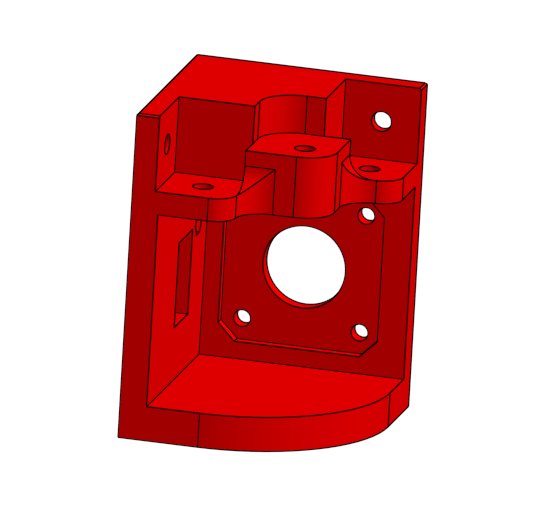

## 2. Glissiere de guidage Axe X:
Cette pièce a été conçue comme une glissière de guidage pour l’axe X du robot. Son rôle principal est de maintenir et guider les roues qui se déplacent le long du profilé aluminium, assurant ainsi un mouvement linéaire fluide et précis du chariot.

La géométrie de la pièce permet un positionnement précis des roues afin de garantir un bon alignement avec le rail de guidage et de limiter les jeux mécaniques. Les différents perçages intégrés facilitent la fixation de la pièce sur la structure ainsi que le montage des éléments de guidage.

Le choix d’une pièce imprimée en 3D a permis d’intégrer plusieurs fonctions dans un seul composant : support des roues, interface de fixation et maintien de l’alignement. Cette conception réduit le nombre de pièces nécessaires, simplifie l’assemblage et facilite les opérations de maintenance ou de remplacement. Grâce à cette glissière, le déplacement sur l’axe X reste stable, précis et reproductible, ce qui est essentiel pour le positionnement des pièces du puzzle.

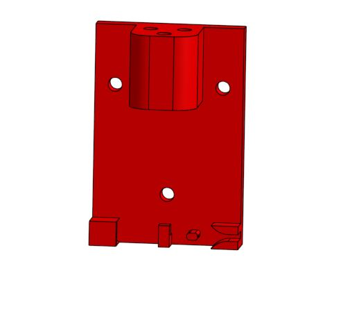   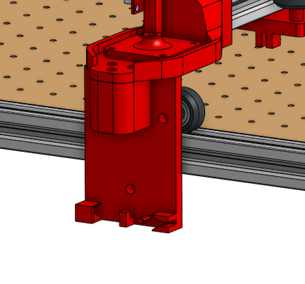

## 3. Support moteur Axe de deplacement
Cette pièce a été conçue pour assurer la fixation des moteurs pas à pas responsables du déplacement du robot le long de son axe principal. Elle sert d’interface entre le moteur et la structure en profilés aluminium, tout en garantissant un positionnement précis et un alignement correct avec le système d’entraînement.

Le support intègre directement les perçages nécessaires à la fixation du moteur ainsi que les renforts mécaniques permettant de supporter les efforts générés lors des accélérations et des changements de direction. Sa géométrie a été optimisée afin de limiter les déformations tout en conservant une pièce compacte et facilement imprimable en 3D.

Contrairement à une configuration avec un seul moteur, nous avons choisi d’installer un support moteur de chaque côté du robot. Cette solution permet de répartir les efforts de manière symétrique sur la structure et d'assurer un entraînement plus homogène de l’axe de déplacement.

L’utilisation de deux supports moteurs améliore également la stabilité mécanique de l’ensemble, réduit les contraintes appliquées aux profilés et limite les risques de désalignement. Cette conception contribue ainsi à obtenir des mouvements plus fluides, une meilleure précision de positionnement et une plus grande fiabilité du robot lors de son fonctionnement.

    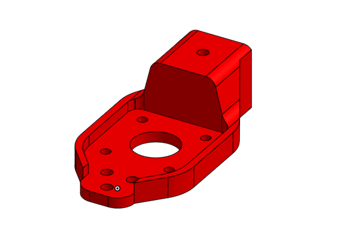

## 4. Glissière de translation sur l’axe Y

Cette pièce constitue le chariot mobile se déplaçant sur l’axe Y du PuzzleBot. Elle a été conçue pour regrouper et supporter l’ensemble des éléments nécessaires à la manipulation des pièces du puzzle de manière compacte et ergonomique.

On y retrouve notamment les deux servomoteurs, l’un dédié au levage de la pièce et l’autre à sa rotation, ainsi que la pompe à vide et l’électrovanne utilisées pour le système de préhension. L’implantation de ces composants a été étudiée afin d’optimiser l’encombrement, de faciliter le passage des câbles et des tuyaux, et de maintenir un bon équilibre de l’ensemble mobile.

Pour compléter ce mécanisme, nous avons également conçu la pièce jaune qui assure les mouvements de levage et de rotation de la pièce saisie. Cette pièce joue un rôle essentiel dans la manipulation des éléments du puzzle en permettant leur prise, leur orientation et leur repositionnement avec précision.  

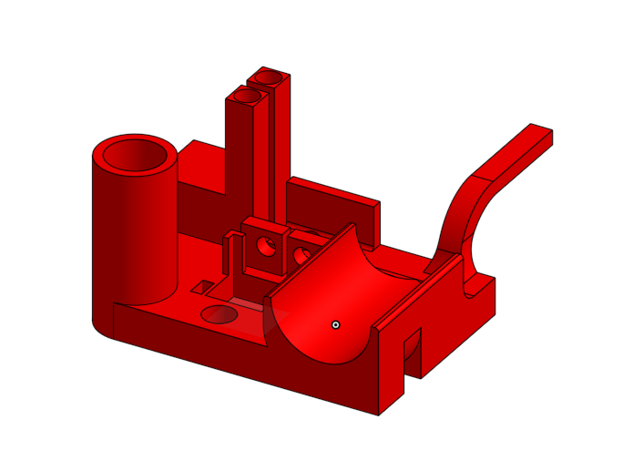  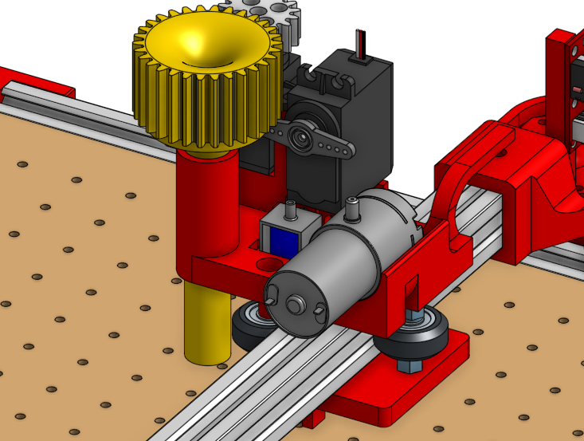

## 5.Cage de la carte electronique

Nous avons également conçu une petite boîte en 3D dédiée à la protection de la carte électronique. Cette boîte, placée sous le plateau, permet de sécuriser l’électronique contre les chocs et les poussières. Elle a été conçue sur mesure pour s’intégrer parfaitement sous le plateau, optimisant l’espace tout en garantissant un accès facile pour les câbles. Ainsi, l'ensemble de la machine reste bien organisé et protégé.

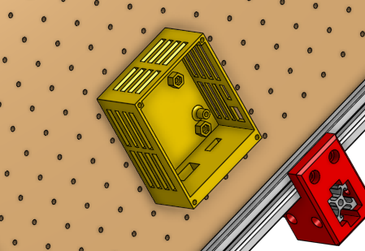

## 6. Système de support de la caméra
Pour garantir une acquisition d'image stable et précise, nous avons conçu un ensemble de pièces permettant de maintenir la caméra au-dessus de la zone de travail. Cette structure devait être suffisamment rigide pour éviter les vibrations tout en restant simple à assembler sur le châssis du PuzzleBot.

### a- Supports de base

Les supports de base assurent la liaison entre les montants verticaux de la structure caméra et le châssis du robot. Initialement, un seul support avait été envisagé sur un côté du robot. Cependant, afin d'améliorer la rigidité de l'ensemble et de limiter les vibrations, nous avons finalement adopté une configuration symétrique avec un support de chaque côté.

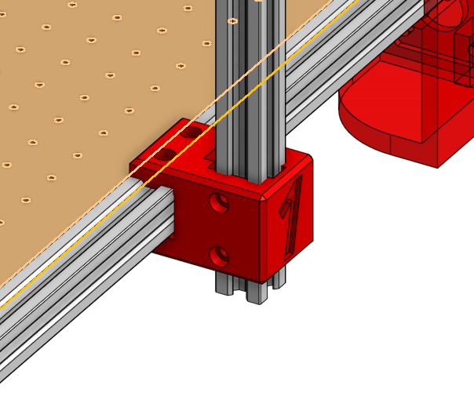   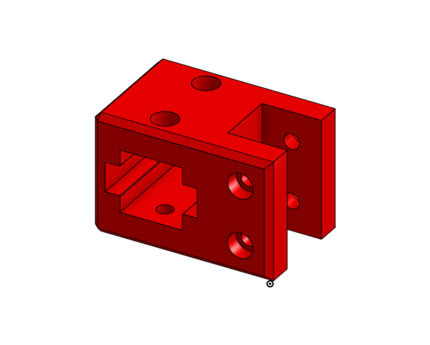

### b- Supports supérieurs

Les supports supérieurs permettent de fixer la traverse horizontale reliant les deux montants verticaux. Ils assurent le maintien de l'équerrage de la structure et garantissent une bonne répartition des efforts mécaniques. Leur conception facilite également l'assemblage des profilés aluminium.

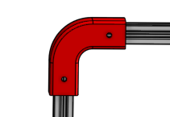   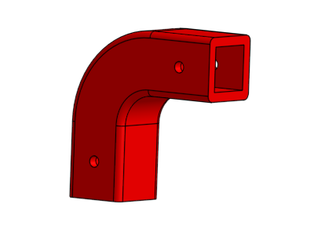   

### c- Cage de la caméra

La cage de la caméra a été spécialement conçue pour accueillir et maintenir la caméra dans une position fixe au-dessus du plateau de jeu. Elle assure un positionnement précis de la caméra tout en permettant un montage et un démontage rapides pour les opérations de maintenance ou d'ajustement

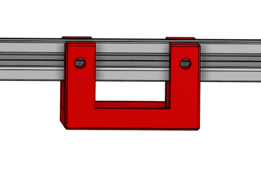 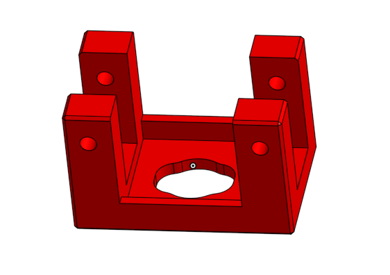 

### d- Structure complète

L'association des supports de base, des supports supérieurs et de la cage de la caméra forme une structure robuste et stable. Cette conception garantit une vue globale du plateau tout en assurant la qualité des images nécessaires à la détection et à l'identification des pièces du puzzle.

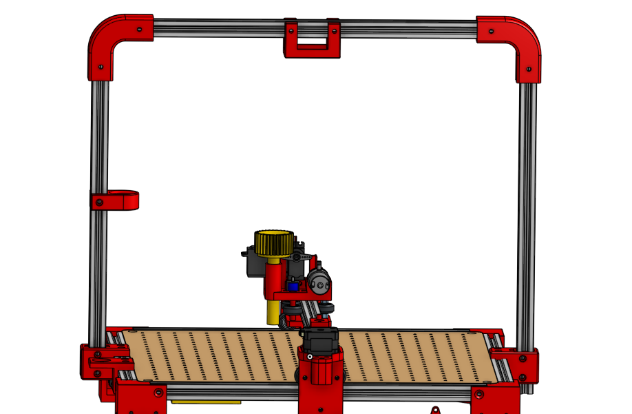   

# Assemblage du Puzzle Bot

## **Étapes d'Assemblage**

Après la préparation des matériaux, l'étape suivante est l'assemblage des pièces principales et la fixation solide des pièces ensemble en utilisant les outils appropriés.

## **Organisation de l'assemblage**
   
Avant de commencer l'assemblage, nous avons réalisé une analyse globale de la machine afin de comprendre les relations entre les différents sous-ensembles mécaniques. Cette étape nous a permis d'identifier les pièces à imprimer en 3D, les profilés à assembler ainsi que les composants nécessaires au système de déplacement afin de prévoir le plus possible les impressions et les délais qui leur sont associés.

Les pièces de couleur rouge dans le modèle final correspondent aux pièces fabriquées par impression 3D. Ces pièces ont été conçues pour assurer la liaison entre les profilés en aluminium, les moteurs et les différents éléments mobiles de la machine.

**Répartition des tâches**

L'assemblage du châssis principal a été réalisé par Byron et Esteban. Nous avons procédé de manière progressive en divisant la machine en plusieurs sous-ensembles :

- Structure de base (châssis principal)
- Supports du plateau
- Système de guidage de l'axe Y
- Système de guidage de l'axe X
- Portique vertical
- Support de l'outil de travail
- Supports moteurs et système de courroies

## **Assemblage initial et fixation**
   
**Etape 1 : Construction du châssis principal**

La première étape a consisté à assembler la structure de base à partir des profilés en aluminium et des pièces imprimées en 3D servant d'équerres et de fixations.
L'objectif était d'obtenir une structure rigide et parfaitement carrée qui servirait de référence pour tout le reste de l'assemblage.

**Étape 2 : Installation des supports du plateau**

Nous avons ensuite imprimé et installé les quatre supports d'angle du plateau.
Ces supports ont deux fonctions principales :
- Surélever la machine afin de créer un espace libre sous le plateau afin de mettre des roulements sous le plateau et au dessus pour stabiliser l'ensemble.
- Permettre l'installation future de la carte électronique et du câblage sous la structure. Cette solution améliore l'organisation des composants électroniques tout en facilitant leur maintenance.

**Étape 3 : Mise en place des guidages de l'axe Y**

Les rails et les supports de guidage de l'axe Y ont été montés sur le châssis principal.
Une attention particulière a été portée à leur parallélisme afin d'éviter les frottements et les pertes de précision lors du déplacement.

**Étape 4 : Installation des moteurs et du système de courroies**

Des supports spécifiques imprimés en 3D ont ensuite été fixés pour accueillir :
- Les moteurs pas à pas.
- Les poulies.
- Les tendeurs de courroies.
Ces éléments permettent la transmission du mouvement sur les axes X et Y.
Le positionnement des supports a été ajusté afin de garantir une tension correcte des courroies et un mouvement fluide de l'ensemble mobile.

**Étape 5 : Montage du portique**

Les montants verticaux ont été assemblés puis reliés par une traverse supérieure formant le portique.
Cette structure supporte le système de déplacement de l'axe X et le système d'aspiration.

**Étape 6 : Installation du chariot mobile**

Le chariot central a été fixé sur les guidages afin de permettre le déplacement de l'outil sur les différents axes.
Les différents supports imprimés en 3D ont été assemblés et ajustés jusqu'à obtenir un mouvement régulier sans jeu excessif.

# Resultat
Voici la vue globale de notre PuzzleBotapres toutes les finitions

  

## **Problèmes communs et solutions**

Au cours de l'assemblage, plusieurs difficultés sont apparues, notamment lors de l'impression 3D des pièces. Certains défauts, comme des sous-extrusions, des déformations ou des couches mal superposées, ont rendu certaines pièces inutilisables.

Pour résoudre cela, nous avons ajusté les paramètres d'impression ou la forme d'impression. De plus, après avoir identifié les pièces problématiques, nous avons modifié certains designs, par exemple en ajoutant des renforts ou en ajustant les tolérances, pour garantir un assemblage plus précis. Grâce à ces corrections, nous avons pu obtenir des pièces conformes, permettant un assemblage stable et fonctionnel de la machine.
