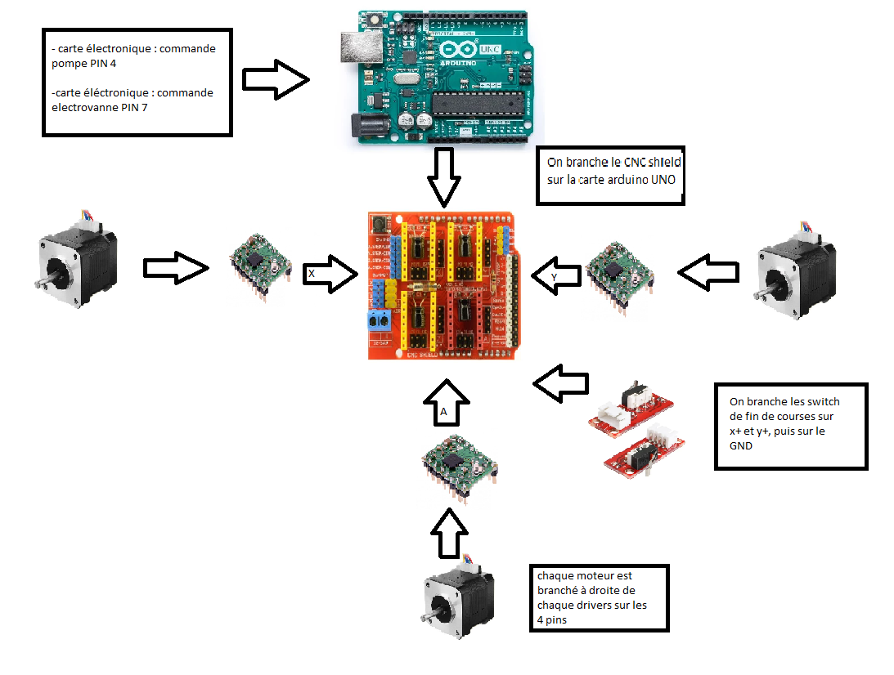

# Electronique

## Architecture Électronique & Câblage

L'architecture électronique du Puzzle Bot est conçue autour d'une carte microcontrôleur Arduino UNO sur laquelle vient s'emboîter une carte d'extension CNC Shield V3. Cette configuration permet de centraliser la distribution de la puissance (12V) et les signaux de commande de l'ensemble des actionneurs et capteurs.

Voici le schéma synoptique de notre installation électronique (mettant en évidence les liaisons entre l'Arduino, le CNC Shield, les moteurs et les capteurs) :

### Liste des composants électroniques

- Arduino Uno

- CNC Shield V3

- X3 Drivers ref : A4988

- X2 Servo Moteurs 
 

    *Moteurs permettant de lever et de faire tourner les pièces.

- X3 Moteurs pas à pas

    *Moteurs permettant de faire bouger les pièces sur l'axe x et y.

- Pompe et électrovanne

    *Permettant d'aspirer les pièces pour les lever.

- X2 Switch de fin de course

    *Permet de stopper les moteurs lorsque les switchs sont déclenchés (on s'en servira pour le homing de notre machine).

### Tableau des connexions

Pour garantir la maintenabilité du robot, l'intégralité du câblage physique a été répertoriée selon l'affectation suivante :

| Composant | Broche Arduino | Rôle sur le CNC Shield | Type de signal |
| :--- | :---: | :---: | :--- |
| **Moteurs X (x2)** | D2 / D5 | X.STEP / X.DIR | Impulsions de commande (Miroir) |
| **Moteur Y** | D3 / D6 | Y.STEP / Y.DIR | Impulsions de commande |
| **Fin de course X** | D9 | X+ | Entrée numérique (Pull-up) |
| **Fin de course Y** | D10 | Y+ | Entrée numérique (Pull-up) |
| **Servo Rotation** | D11 | Z+ | Sortie PWM (0-180°) |
| **Servo Z (Bras)** | A5 | SCL | Sortie PWM (Bit-banging) |
| **Pompe à vide** | D4 | Z.STEP | Commande Tout-ou-Rien (via MOSFET) |
| **Électrovanne** | D7 | Z.DIR | Commande Tout-ou-Rien (via MOSFET) |

### Réglage des drivers

Chaque moteur doit être limité par un driver car la carte branchée en 12V distribue trop de courant dans les moteurs, cela pouvant entrainer un endommagement des moteurs et du matériel.

Nos drivers sont les A4988 donc  on  utilise  cette formule pour avoir la limite de courant souhaité :  

On va trouver ici **Vref = 0,5 Volts** comme valeur optimale pour le réglage de nos drivers.

Maintenant que nous avons trouvé notre **Vref**, nous devons mesurer la tension du potentiomètre de notre driver, en branchant sur la vis du potentiomètre ainsi que le GND (comme sur l'image ci-dessus), le multimètre.

*Pour pratiquer le réglage des drivers, il faut s'assurer qu'ils soient sur la carte CNC shield, elle-même branchée sur la carte arduino le tout relié en 12V grâce à l'alimentation. Pour la démonstration ci-dessus nous n'avons pas branché les drivers pour que cela soit compréhensible.*

Comme nous pouvons le voir sur la deuxième image la tension mesurée est de 0,34 Volts, et on doit l'augmenter jusqu'à notre Vref (0,5 Volts) trouvé précédemment en tournant légèremment la vis du potentiomètre.
On répète ainsi cela pour nos 3 drivers.

Nous nous sommes inspiré de cette [vidéo](https://youtu.be/89BHS9hfSUk?si=hmqyH-yPLVSg_-tl) pour le réglage des drivers.

### Gestion de la puissance et carte MOSFET
Les sorties de l'Arduino UNO délivrent un courant maximal insuffisant et une tension limitée à 5V. Or, l'électrovanne et la pompe pneumatique requièrent une alimentation stable en 12 Volts. 

Pour résoudre ce problème, nous avons développé une carte électronique d'interface de puissance sous le logiciel KiCad. Cette carte intègre des transistors MOSFET faisant office de relais électroniques rapides. Lorsqu'un signal 5V est émis par les broches D4 ou D7 de l'Arduino, le MOSFET commute et libère la puissance de la ligne 12V pour actionner la pompe ou ouvrir la valve pneumatique.

### Optimisation et routage
Afin de fiabiliser le fonctionnement du robot et de libérer l'espace supérieur pour les déplacements du portique, l'ensemble des cartes électroniques (Arduino, CNC Shield, circuit MOSFET) a été implanté directement sous le plateau de la machine. Les câbles moteurs et capteurs ont été rallongés et guidés au travers du châssis pour éviter tout risque d'arrachement ou d'interférence avec la tête mobile.
