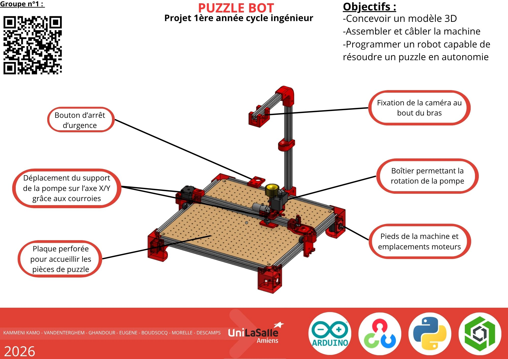

# Bienvenue sur notre documentation

Bienvenue dans la documentation du projet PUZZLE BOT. Ce site a pour but de fournir toutes les informations nécessaires pour comprendre, utiliser et reproduire efficacement notre projet.

[Notre projet sur Onshape]([https://cad.onshape.com/documents/2860ed3d58f1b518e6857770/w/82b3c0e474623135ccb76fa3/e/0cab16137cd459ee83ebe56e?renderMode=0&uiState=6936dc0e23fecc27d34268b2](https://cad.onshape.com/documents/dc4e4dc410142a1f5ec17e75/w/6949f91d3f7293487ebace9c/e/d7efde2f999041b5a5ef0852)){: .btn .btn-primary .fs-5 .mb-4 .mb-md-0 .mr-2 }
[Notre repo GitHub](https://github.com/Makerspace-Amiens/template-project){: .btn .fs-5 .mb-4 .mb-md-0 }

<iframe height="600" width="100%" src="https://modelembedder.net/embed?did=dc4e4dc410142a1f5ec17e75&wvm=v&wvmid=8dbde0cae67cbb0ab40cced3&eid=d7efde2f999041b5a5ef0852&elementType=ASSEMBLY" frameborder="0"></iframe>

## À propos du Projet

Notre projet consiste à concevoir et programmer un robot capable de résoudre automatiquement un puzzle de manière autonome. Réalisé pendant notre première année de cycle ingénieur, ce projet nous permet de mettre en pratique des notions de mécanique, d’électronique, d’informatique et d’automatisation.

Le robot est destiné principalement à un usage pédagogique et expérimental. Il permet de découvrir le fonctionnement des systèmes embarqués, de la programmation d’algorithmes de résolution et de la coordination entre capteurs, moteurs et traitement des données.

Ce projet cherche à résoudre plusieurs problématiques techniques : analyser l’état d’un puzzle, déterminer une stratégie de résolution puis exécuter les mouvements nécessaires de manière précise et autonome. Hormis le côté technique, il vise également à développer notre capacité à travailler en équipe, à gérer un projet d’ingénierie et à réfléchir pour trouver une solution répondant à un défi concret.

## Poster

Ci-dessous, le poster que nous avons réalisé afin d'expliquer les principaux principes de fonctionnement de notre machine, les objectifs de notre projet, les logiciels utilisés ainsi qu'un QR code permettant d'accéder à ce répertoire github.

## Vidéo

Ici, vous pouvez retrouver une courte [vidéo youtube](https://youtube.com/shorts/hwhFVxFwka4?is=Uxh004fbql3rNZwD) d'une minute et trente secondes retraçant les premiers pas de notre projet jusqu'à son résultat aujourd'hui.

Voici également un QR-code que vous pouvez scanner afin d'y accéder également.

---
